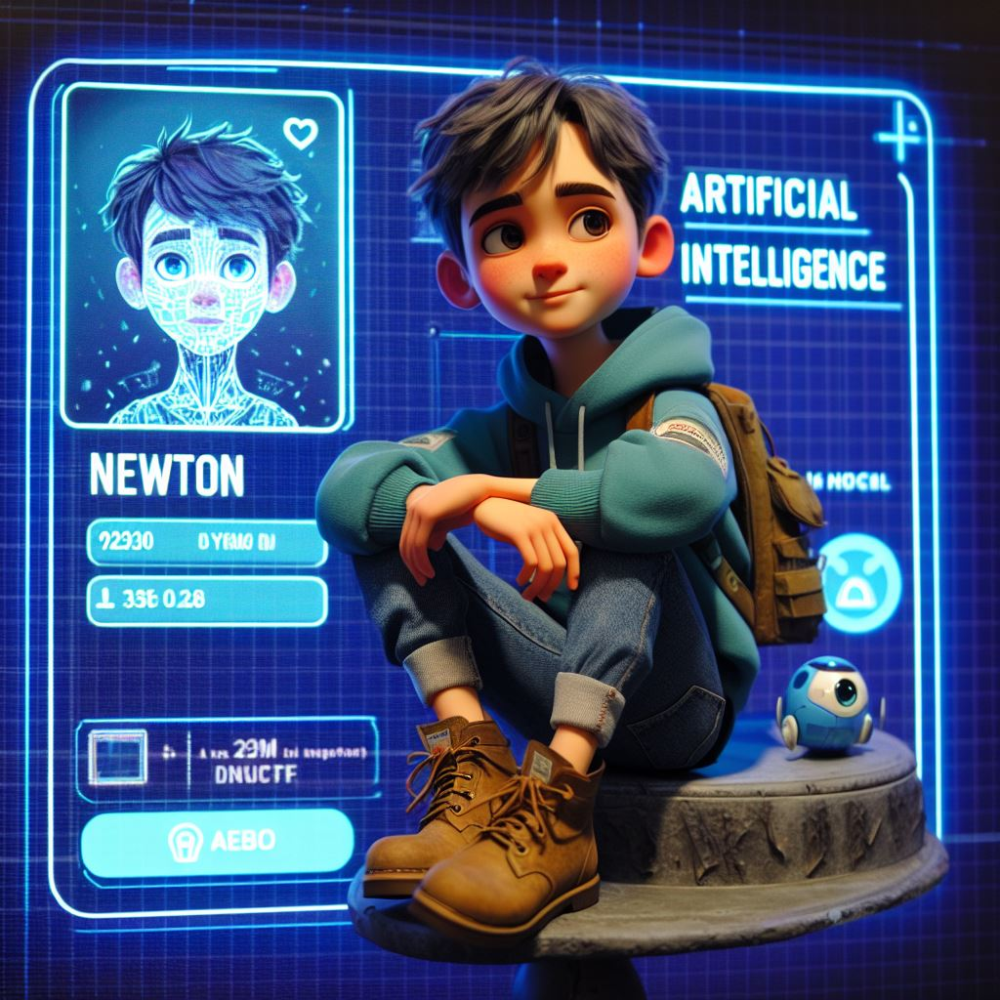

# Hi there, I'm Ravish Kumar Tiwari 👋

I'm a B.Tech student in Computer Science and Engineering with a specialization in Artificial Intelligence and Machine Learning. I love to learn new things and solve problems. I have experience in web development, data analysis, and machine learning. I'm currently working on some cool projects using React, Flask, and TensorFlow.

## 🛠️ My skills

| Web Development | Data Analysis | Machine Learning |
| --------------- | ------------- | ---------------- |
| HTML            | Python        | TensorFlow       |
| CSS             | NumPy         | PyTorch          |
| JavaScript      | Pandas        | Scikit-learn     |
| React           | Matplotlib    | Keras            |
| Bootstrap       | Seaborn       | OpenCV           |
| Flask           | SQL           | NLTK             |

## 📈 My GitHub stats

!ravish's GitHub stats

## 🌐 Find me on

[LinkedIn](https://www.linkedin.com/in/ravish-kumar-tiwari-37b030231?utm_source=share&utm_campaign=share_via&utm_content=profile&utm_medium=android_app) | [Portfolio](RKTWorld.netlify.com)
